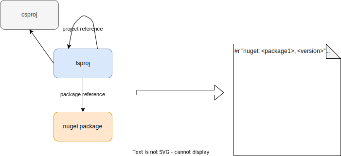
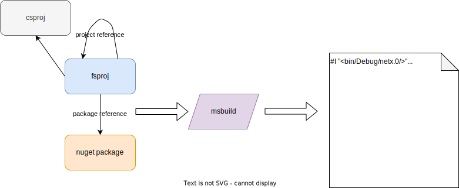

# Amplifying F# Session (2023-07-13)

## The Idea



or maybe




## History

- [Original Project from Chris](https://github.com/ionide/DependencyManager.FsProj)
- [Forked](https://github.com/ThisFunctionalTom/DependencyManager.FsProj)
  - Deployment as [dotnet tool](https://www.nuget.org/packages/DependencyManager.FsProj/)
  ```pwsh
  dotnet tool install --global depman-fsproj
  ```


## How F# DependencyManagers work?

- [Interface](../../fsharp/src/FSharp.DependencyManager.Nuget/FSharp.DependencyManager.fsi)

### Implementations

- [Nuget](../../fsharp/src/FSharp.DependencyManager.Nuget/FSharp.DependencyManager.fs)
- [Paket](../../Paket/src/FSharp.DependencyManager.Paket/PaketDependencyManager.fs)


## Known problems

- Not working with .NET 7 and newest Ionide.ProjInfo
- Version with "dotnet list package" reenters all the time. How to get logs from fsi?
- Deployment is still not simple enough? Or is it?
- fsproj target framework and fsi framework missmatch  (FSharp.Core for example)

## Goal

- Learn a lot about FSharp, FSharp.Compiler.Service, Ionide.ProjInfo, MsBuild...
- Discuss different solution possibilities
  - Ionide.ProjInfo
  - dotnet list package, dotnet list reference
  - Build project and reference dll
- Discuss different deployment scenarios
  - built into fsharp repo
  - dotnet tool
  - some other ideas?
- Decide in which direction to go from here

## Decisions

- 

## TODOs

- [ ] 